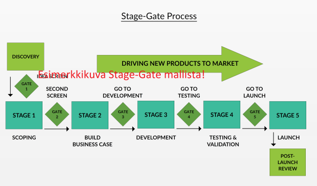

# Stage-Gate tuotekehityksen viitekehys 
(HUOM! Tämä on esimerkki GitHubin testausta varten ja tarkoitus herättää ajatuksia siitä mitä GitHubissa julkaistava materiaali tulisi sisältää. Korjausehdotuksia ja kehitysajatuksia toivotaan)

# Julkaisun historiatiedot
Merkittävät muutokset julkaisuun.
|pvm|Nimi|Tekijä|
|---|---|---|
|18.1.2023|Martti Hämäläinen|Lisätty julkaisun historiatiedot|

# Sisällysluettelo
- [Stage-Gate tuotekehityksen viitekehys](#stage-gate-tuotekehityksen-viitekehys)
- [Julkaisun historiatiedot](#julkaisun-historiatiedot)
- [Sisällysluettelo](#sisällysluettelo)
- [Teknologiapilotti](#teknologiapilotti)
- [Hanketiedot](#hanketiedot)
- [Kuvaus](#kuvaus)
  - [Stage-Gate tuotekehityksen viitekehys](#stage-gate-tuotekehityksen-viitekehys-1)
  - [Stage-Gate viitekehyksen kuvaus](#stage-gate-viitekehyksen-kuvaus)
  - [Matemaattisten kaavojen esittämäminen](#matemaattisten-kaavojen-esittämäminen)
- [Tavoitteet (esim. hankejulkaisussa)](#tavoitteet-esim-hankejulkaisussa)
- [Toimenpiteet (esim. hankejulkaisussa)](#toimenpiteet-esim-hankejulkaisussa)
- [Asennus (esim. koodin julkaisussa)](#asennus-esim-koodin-julkaisussa)
- [Vaatimukset (esim. koodin julkaisussa)](#vaatimukset-esim-koodin-julkaisussa)
- [Käyttö/käynnistys (esim. koodin julkaisussa)](#käyttökäynnistys-esim-koodin-julkaisussa)
- [Tulokset (esim. hankejulkaisussa)](#tulokset-esim-hankejulkaisussa)
- [Lisenssi](#lisenssi)
- [Tekijät](#tekijät)

# Teknologiapilotti

Linkki pilotin julkaisuun, jos sellainen löytyy.

# Hanketiedot
Esim.
Stage-Gate esimerkkisivusto on julkaistu Kasvua tuotekehityksellä Etelä-Pohjanmaan valmistavan teollisuuden pk-yrityksissä -hankkeessa.

- Hankkeen nimi: Kasvua tuotekehityksellä Etelä-Pohjanmaan valmistavan teollisuuden pk-yrityksissä
- Hankkeen rahoittaja: Euroopan Sosiaalirahasto ESR
- Kehityshankkeen aikataulu: 1.3.2020 – 30.06.2023

Lisätietoa hankkeesta:
[Kasvua tuotekehityksellä Etelä-Pohjanmaan valmistavan teollisuuden pk-yrityksissä -hankkeen nettisivut](https://projektit.seamk.fi/alykkaat-teknologiat/kasvua-tuotekehityksella-valmistavan-teollisuuden-pk-yrityksissa/)

# Kuvaus

## Stage-Gate tuotekehityksen viitekehys
Esim.

Stage-Gate on uustuotekehityksessä yleisesti käytetty viitekehys, joka jakaa tuotekehitysprosessin vaiheisiin ja portteihin. Porttien tehtävä on varmistaa, että määritellyt tehtävät ovat edellisen vaiheen aikana tehty. Tämän lisäksi portit toimivat myös välietappeina joissa arvioidaan onko projektia syytä jatkaa eteenpäin. 

## Stage-Gate viitekehyksen kuvaus

|Nimi|Linkki|
|---|---|
| Stage-gate tuotekehityksen viitekehys -pdf-formaatissa | |
| Stage-gate tuotekehityksen viitekehys -Youtube-video ||

Ohessa linkki yhteistyörobotiikan koneturvallisuusnäkökulmiin, joita VTT on tutkielmassaan esittänyt
[Ohessa linkki](/content/VTT_Sgn_CobotSafety2022.pdf)

## Matemaattisten kaavojen esittämäminen
Matemaattiset kaavat voidaan esittää $ ja $$-merkeillä erotellulla LaTeX-syntaksilla, esim.
**Poisson-jakauma** voidaan kirjoittaa $$f(x) = \frac{ \mu^x}{x!}e^{-\mu} ,(x = 0, 1, ...)$$, mikä näyttää seuraavalta:
$$f(x) = \frac{ \mu^x}{x!}e^{-\mu} ,(x = 0, 1, ...)$$  

# Tavoitteet (esim. hankejulkaisussa)
Kuvaus tavoitteesta, jos julkaisussa on tarvetta määrittää tavoite

# Toimenpiteet (esim. hankejulkaisussa)
Julkaisun tavoitteeseen liittyvät toimenpiteet

# Asennus (esim. koodin julkaisussa)
Käytä asennusohjeessa koodinupotuslaatikkoa selventämään komentoriville kirjoitettavia komentoja.
Esim:
~~~
npx create-react-app my-app
~~~

Koodin julkaisussa kirjoita ohjelmointikielen nimi (esim. ~~ ~~python), jolloin saat värit selventämään koodia.
~~~python
def add(a, b):
    # This function returns the sum of given numbers
    return a + b
~~~

# Vaatimukset (esim. koodin julkaisussa)
Tähän edellytykset mitä tarvitaan, jotta ohjelma toimii.

# Käyttö/käynnistys (esim. koodin julkaisussa)
Tähän kuinka ohjelmaa käytetään/käynnistetään. Esim:

Käynnistä ohjelma project-kansiossa
~~~~
npm start  
~~~~
ja avaa selaimessa
~~~~
http://localhost:3000
~~~~

Huom! Koodiesimerkit React-tutorialista. [Tutorial: Intro to React](https://reactjs.org/tutorial/tutorial.html)

# Tulokset (esim. hankejulkaisussa)
Esim:
Hankkeen tuloksena syntyy:
- Alueen valmistavan teollisuuden pk-yrityksen henkilöstölle soveltuva tuotekehityksen malli
- Jatkuvan oppimisen alusta oppimateriaaleineen
- Tapauskuvauksia alueen valmistavan teollisuuden pk-yrityksistä
- Koko ekosysteemin uusi tapa toimia ja jakaa osaamistaan
  
# Lisenssi
Dokumentit lisensoitu:

Ohjelmakoodit lisensoitu:

# Tekijät
- Martti Hämäläinen
- Juho Pirttilahti

